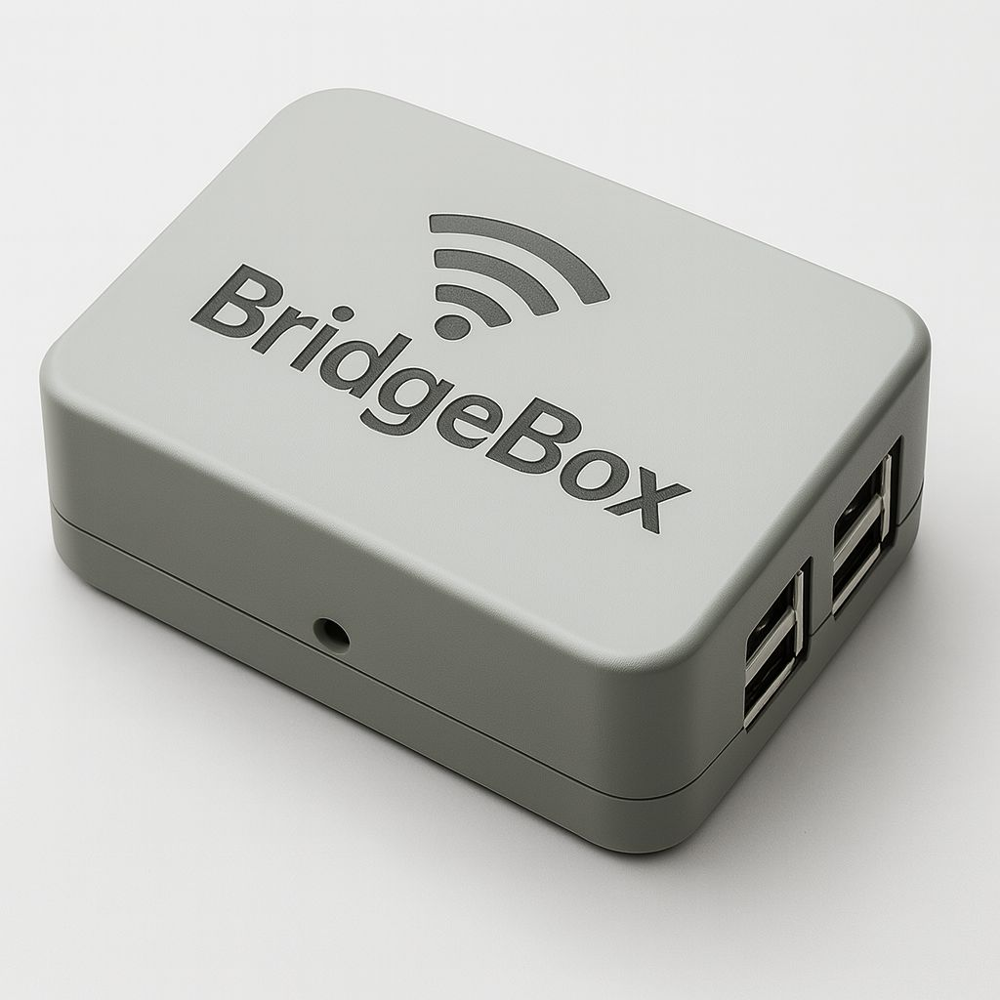

# BridgeBox

<p align="center">
  
</p>

**BridgeBox** is Zee Tech Foundation’s commitment to solving one of the most persistent barriers in education across Northern Nigeria: limited access to digital learning resources. While technology is transforming classrooms globally, thousands of schools in rural Nigeria still operate in isolation, disconnected from the digital ecosystem.

BridgeBox was designed as an innovation that bridges this gap — literally serving as a **digital bridge** between disconnected learners and modern educational opportunities. This document is prepared to help our team fully understand the problem, the solution, our strategy, and the broader impact we intend to create. Every member of the team is encouraged to study it carefully, as it forms the foundation of our shared vision for the **i-FAIR innovation journey** and beyond.

## What We Are After

- **Access:** Deliver reliable, offline-first digital learning resources to rural and underserved schools.
- **Equity:** Reduce the educational divide between connected and disconnected communities.
- **Scalability:** Build a repeatable model that can expand across Northern Nigeria and beyond.
- **Impact:** Improve learning outcomes and open pathways to modern educational opportunities.

## The Problem

- Rural schools often lack stable internet, reliable power, and up-to-date learning materials.
- This creates a persistent gap between students in connected urban areas and those in remote communities.

## The BridgeBox Solution

- A compact, durable device that brings curated educational resources directly to schools.
- Designed to function in low-connectivity environments and serve as a local learning hub.
- Built to be easy to deploy, maintain, and scale.

## Strategy

- **Local-first deployment:** Prioritize regions with the greatest access gaps.
- **Community partnerships:** Work with educators, local leaders, and institutions.
- **Sustainable operations:** Ensure long-term viability through training and support.

## Intended Impact

- More students gain access to quality, relevant digital content.
- Teachers receive tools to enhance instruction and engagement.
- Communities gain pathways to modern knowledge and opportunity.

## Team Note

This README is the shared foundation for our work. If you are new to the project, start here and align on the mission before diving into implementation details.

Dummy login details (seeded):

Admin: admin@bridgebox.local / BridgeBox@123
Teacher: teacher@bridgebox.local / BridgeBox@123
Student: student@bridgebox.local / BridgeBox@123

## Developer Quick Start

A few developer-focused notes to help iterate quickly:

- Use the setup script dry-run for safe validation:

```bash
sudo bash setup/onetimesetup.sh --dry-run
```

- To save hotspot defaults from the admin UI (saved to server storage): Admin Dashboard -> Admin Controls -> Hotspot Settings. This stores `storage/app/hotspot.json` on the server.

- Offline alert styles are provided locally at `public/assets/css/bootstrap-alerts.css` so the UI works without CDN access.

- CI: A basic GitHub Actions workflow has been added at `.github/workflows/ci.yml` to run `composer install` and `phpunit` if tests exist.

If you'd like I can add a backup artisan command, implement applying hotspot settings via the admin UI (requires careful sudo handling), or wire up frontend fetching of saved hotspot defaults.